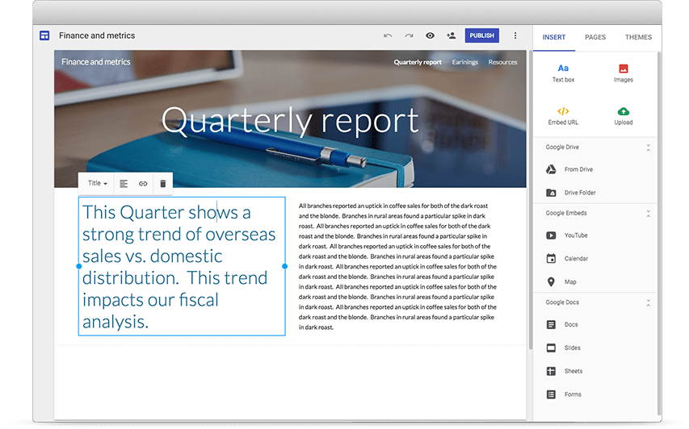

# Google Sites

## wikipedia definition

[Google Sites](https://en.wikipedia.org/wiki/Google_Sites) is a structured wiki and web page creation tool included as part of the free, web-based Google Docs Editors suite offered by Google.  Google Sites is only available as a web application. The app allows users to create and edit files online while collaborating with other users in real-time.

## Link

* [https://sites.google.com/new](https://sites.google.com/new)

## Example

## Pros

* It is free
    * you can even create multipe google sites for free
* fine grained security
    * you can specify who can have read/write/administrator access to your google site
* very easy to create/edit pages
* responsive web design (looks good on any screen)
* several templates
* supports some integration with google products (like google drive, google spreadsheet, google calendar,...)

## Cons

* requires internet access
* requires a google account
* dependent on google terms and conditions (things might change in the future)
* mainly a simple static website (no dynamic content) with very limited configuration possibilities.
