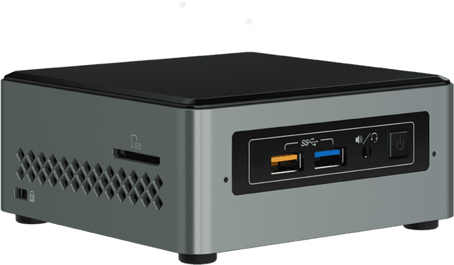
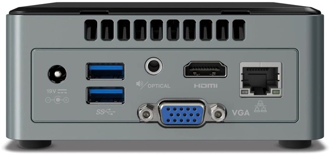
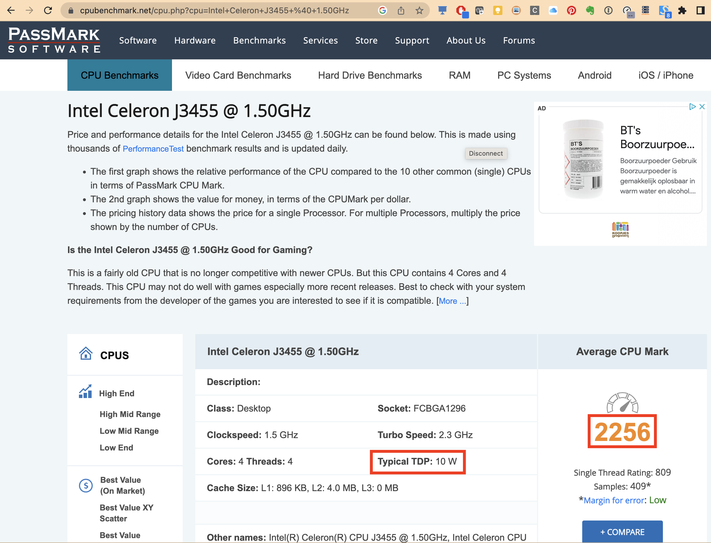

# Intel NUC

## What

!!! quote "[Wikipedia definition of NUC](https://en.wikipedia.org/wiki/Next_Unit_of_Computing)"

    Next Unit of Computing (NUC) is a line of small-form-factor barebone computer kits designed by Intel.  ... The NUC motherboard usually measures approximately 4 × 4 inches (10 × 10 cm), although some models have had different dimensions.[3]
    The barebone kits consist of the board, in a plastic case with a fan, an external power supply, and a VESA mounting plate.

## Buying Tips

1. Save money by buying your NUC (or comparable barebone PC / mini PC) on 2nd hand markets (target price around 140 €)
    * Older models are often sold as they are not powerfull enough as desktop computer, but they are still perfect for running many docker containers
    * it doesn't matter if it is preinstalled with an old windows OS as you will install a new linux OS (ubuntu)
2. 4GB RAM or more
3. 60GB SSD or more
4. CPU speed comparable to Intel Celeron J3455 @ 1.50GHz (passmark average CPU mark around 2000)
5. Energy consumption comparable to Intel Celeron J3455 @ 1.50GHz  (TDP around 10 Watt)

### Checking CPU speed and energy consumption

1. Identify the CPU processor type
2. Enter the CPU processort type followed by passmark in the google search bar (e.g. `Intel Celeron J3455 passmark`)
3. Open the first page (or page with `cpubenchmark.net`)
4. The Average CPU Mark gives an indication of the CPU speed
5. the Typical TDP gives an indication of the energy consumption.

??? example "DEMO showing NUCs on 2nd hand market + determining CPU speed and energy consumption"

    Starting from my (private) slack channel `general` where the devices are posted.

## Nucs in my home network

I have 2 intel nucs with hostnames:

* `nuc1`  (model `NUC6CAYS`)
* `nuc2`  (model `NUC6CAYH`)

I have also an [ASUS Chromebox 2 (CN62)](https://www.asus.com/us/commercial-desktop/asus_chromebox_cn62_commercial/overview/).  Although it is not an intel nuc it is very similar and configured simularly as my 2 intel NUCs and therefore I have given it hostname `nuc3`.

## Hardware specifications model `nuc2`

* **Model** : Intel(R) Client Systems NUC6CAY
* **Version** : [NUC6CAYH](https://www.intel.com/content/www/us/en/products/sku/95062/intel-nuc-kit-nuc6cayh/specifications.html)
* **CPU** : 4x Intel(R) Celeron(R) CPU J3455 @ 1.50GHz
* **Memory** : 8 GB (1600 MT/s)
* **Storage** : CT240BX500SSD1 - Capacity 240.0GB - 6.0Gb/s
* **Audio** : 7.1 digital; L+R+**microphone** (F); L+R+TOSLINK (R)
* **Integrated Wireless** : Intel® Wireless-AC 3168 + Bluetooth 4.
* **Consumer Infrared Rx Sensor**: Yes
* ...

Note that my `nuc1` and `nuc2` have very similar specs.

## Initial Setup of my nuc2 (as headless device)

1. download latest Ubuntu Desktop version (in my case this was `ubuntu-20.04.3-desktop-amd64.iso`)
2. flash this image with `balenaEtcher` to USB memory stick
3. boot nuc2 with this USB memory stick and follow the instructions to install new OS.
4. rebooted
5. [enable ssh](https://linuxize.com/post/how-to-enable-ssh-on-ubuntu-18-04/)
6. [install and enable Cockpit web interface](https://www.answertopia.com/ubuntu/an-overview-of-the-ubuntu-cockpit-web-interface/)
    * by default https://nuc2:9090 won't work in chrome as the site is not considered secure.  To overcome this issue go to a blank section of the denial page and enter `thisisunsafe`.  This will add this URL to a safe list, where you should not be prompted again. (see [link](https://www.technipages.com/google-chrome-bypass-your-connection-is-not-private-message))

??? example "DEMO cockpit web interface"

    open [https://nuc2:9090](https://nuc2:9090)

## Pros and cons compared to raspberry pi 3 model B

### Pros

1. more than 1 GB RAM (very interesting if you want to run (many) memory intensive containers)
2. faster CPU
3. interesting hardware (SSD disk, microphone, infrared sensor, Gigabit LAN)
4. Overall quality
5. benefits of the `linux/amd64` architecture compared to `linux/arm/v7` (or `linux/arm64`) (easier to find container images for `linux/amd64` architecture)
6. benefits of the `Ubuntu` OS compared to `Raspberry Pi OS`.

### Cons

1. Price
2. Power consumption
3. No GPIO pins
