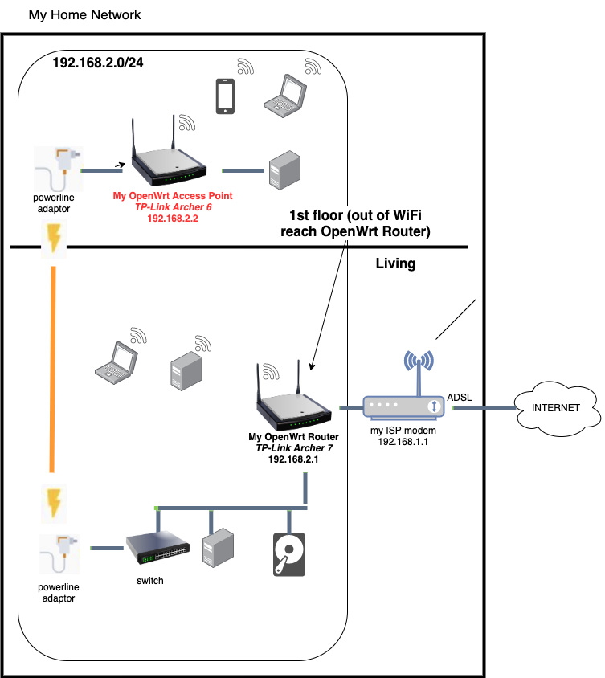

# My OpenWrt Access Point

Before reading this topic, first read topic: [My OpenWRT router](./../openwrt_router/README.md)

## Router Model

**Model** : TP-Link Archer C6 dual-band Gigabit WLAN router (867Mbit / s 5GHz + 300Mbit / s 2.4GHz, 4 Gigabit LAN port, Mu-MIMO, IPTV, VPN, 4 external antennas) black

**Price**: 42 € (march 2020)

**Memory**: 120 MB

**Architecture**: Qualcomm Atheros QCA956X ver 1 rev 0

## Flashed with OpenWrt

**Firmware version** : `OpenWrt 21.02.0 r16279-5cc0535800 / LuCI openwrt-21.02 branch git-21.231.26241-422c175`

## Location in my home network

## Why ?

1. To extend WiFi to 1st and 2nd floor.
    * Note that my [My OpenWRT router](./../openwrt_router/README.md) doesn't provide WiFi coverage up to 1st floor and 2nd floor.
2. [Control WiFi Access (based on time schedule) of my kids](./../openwrt_time_scheduled_access/README.md)

## Configuration as WiFi access point

To keep my network setup simple, I didn't want to create a separate network or subnet.  So for this I configured this router as a [network bridge](https://en.wikipedia.org/wiki/Network_bridge) as specified below:

1. Create a network bridge: Connect powerline adaptor to one of the 4 LAN ports.  Don't use the WAN port: 
2. Setup static IP address for LAN interface (you could also use DHCP) 
3. Setup WIFI using same SSID and password as [my OpenWRT Router](./../openwrt_router/README.md)

## Configuration to control WiFi access of my kids

This is described in topic [OpenWrt Time Scheduled Access](./../openwrt_time_scheduled_access/README.md)

## Conclusion

This setup is used very intensive (e.g. when working at home) and is nearly always working fine.  I admit that in the last 2 years I (or my kids) have faced some temporary network issues.  Not sure if they were related to my OpenWrt routers.  All those issues got resolved from itselves or after a reboot of my router(s).
