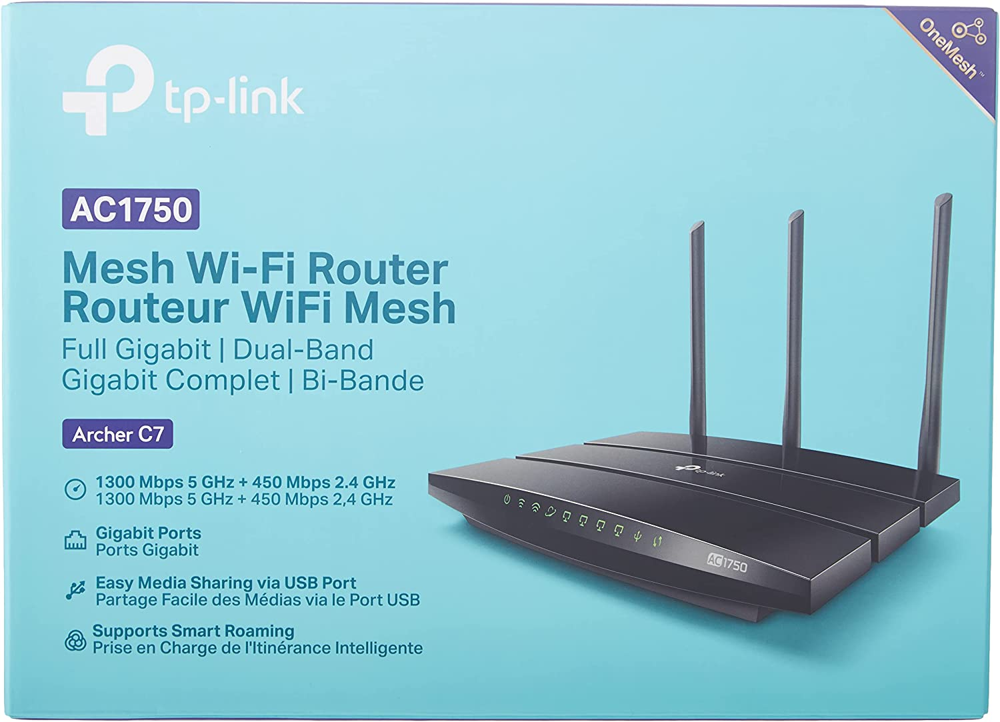
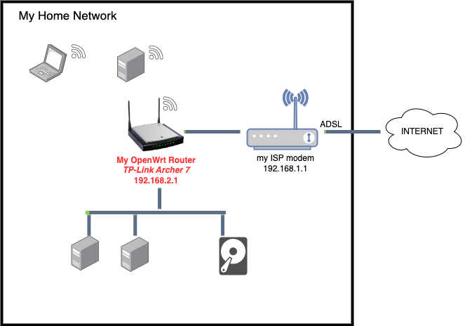
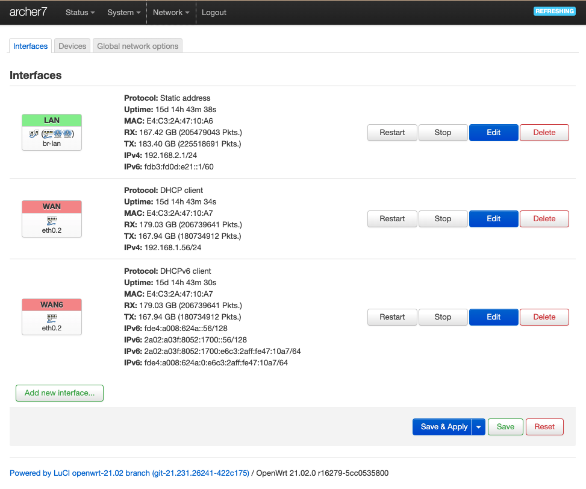
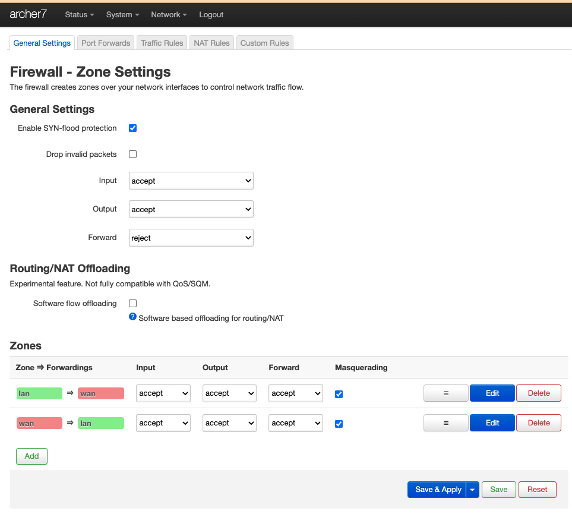
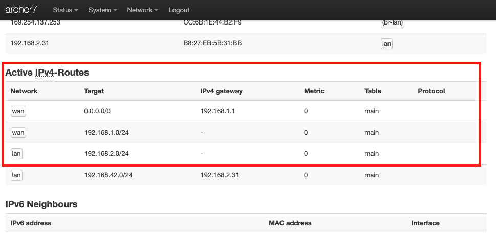
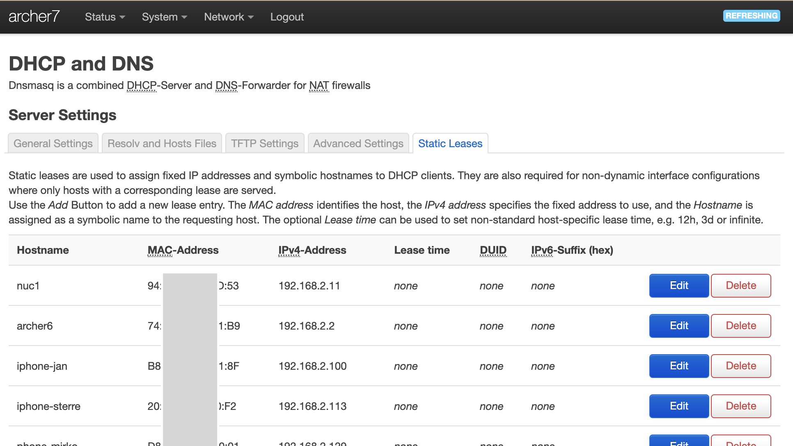
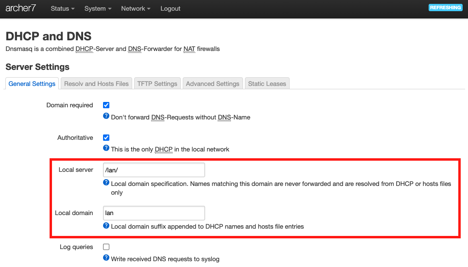

# My OpenWrt Router

## Router Model

**Model** : TP-Link Archer C7 Dual Band Gigabit WiFi-router (1300 Mbps (5 GHz) + 450 Mbps (2,4 GHz), 5 Gigabit LAN-port, 1 USB 2.0-port) Black

**Price**: 56 € (nov 2021)

**Memory**: 120 MB

**Architecture**: Qualcomm Atheros QCA956X ver 1 rev 0



## Flashed with OpenWrt

**Firmware version** : `OpenWrt 21.02.0 r16279-5cc0535800 / LuCI openwrt-21.02 branch git-21.231.26241-422c175`

The [OpenWrt Project](https://openwrt.org/) is a Linux operating system targeting embedded devices (typically wireless routers).

!!! tip "Tip: Assure you buy a router that is in the list of [OpenWrt supported devices](https://openwrt.org/supported_devices)."

## Location in my home network



## Why ?

1. Flashing a router with OpenWrt was on my nerd bucketlist
2. Learn about routers, networking and OpenWrt
3. Have full control to configure your home network
    * This is especially relevant if your ISP modem doesn't allow to configure all things
4. Makes it easier to switch to new ISP or new ISP modem (e.g. switch from ADSL to fiber)
4. Maybe to get better WiFi  (as your are using the WiFi of the OpenWrt Router iso of the ISP modem)

## Configuration

I don't remember everything I did 2 years ago, but a lot of information can be found at:

* [openwrt.org](https://openwrt.org/)
* [openwrt forum](https://forum.openwrt.org/)

??? Danger "Think twice before activating any changes that might make your router inaccessible !"

     It is of course possible to make changes so that you can't access your OpenWrt router anymore from any device.  In that case it is also not possible to correct the issue without doing a `reset` and
     start all over.  (It happened me once)

!!! Tip "The configurations described below can also be performed on most routers/ISP modems !"

### ignored IPv6

I ignored IPv6 configuration.
IPv4 is sufficient for me.

### GUI

OpenWrt comes with a very nice GUI.
Almost everything can be configured by this GUI.

!!! example "[DEMO OpenWrt GUI (LuCi)](http://archer7.lan)"

### Configure routing / network

The main configuration steps (as I remember it) to setup my `192.168.2.0/24` network

#### Configure Network>Interfaces



#### Firewall configuration

Below settings opens firewall in both directions + enables masquerading in both directions.

* allows to ping from OpenWrt Router LAN to ISP modem LAN
* allows to access the internet from OpenWrt Router LAN
* doesn't allow to ping OpenWrt Router LAN from ISP modem LAN
* allows to access OpenWrt Router via its ISP modem LAN IP address (http://192.168.1.56)



#### Configure IPv4-Routes

The routes can be configured via menu `Status > Routes`.  The relevant IPv4 routes are put in a red box.

I think that I didn't configure those routes, by default they were properly setup.



### Configure Static Leases

Instead of working with `/etc/hosts` files and configuring static IP addresses for each device, you can also define static leases (DHCP).  So the DHCP server of the router will automatically assign a static IP address and hostname based on the MAC address.



??? example "[DEMO OpenWrt Static Leases configuration](http://archer7.lan)"

    Demo the assignment of a static lease

??? note "Some devices (e.g. iphones) change MAC address each time they connect."

    So this approach of static leases only works if the MAC address doesn't change.
    For iphone it is possible to configure that it has to use a fixed MAC address for a specific wifi network (disable setting `Private Wi-Fi Address`)

### Configure Local domain `.lan`

The below settings will set the local domain to `.lan`.  So the full name of the hosts defined by the static leases is `<hostname>.lan` (e.g. `nuc1.lan`)



Here below a log of `hostname` and `ping nuc1` command entered in a terminal window on my mac-book connected to my home network.  The hostname, domain and ip address are all configured in my OpenWrt router (see above).

```
mac-jan:tmp jan$ hostname
mac-jan.lan
mac-jan:tmp jan$ ping nuc1
PING nuc1.lan (192.168.2.11): 56 data bytes
64 bytes from 192.168.2.11: icmp_seq=0 ttl=64 time=35.316 ms
64 bytes from 192.168.2.11: icmp_seq=1 ttl=64 time=3.348 ms
```

### Conclusion

The outcome of this configuration:

* I have created my own `192.168.2.0/24` home network (domain `.lan`)
* All (relevant) devices automatically get a static IPv4 address and a hostname via DHCP
* each device in my home network can reach any of the other devices in my home network by just using its hostname (or hostname`.lan`)
* All of this is configured on my OpenWRT router
    * so no specific configuration (E.g. `/etc/hosts`) is needed on any of the devices in my home network.

!!! Note "OpenWrt has a ton of features and [additional software packages](https://openwrt.org/packages/start) that I didn't use."
