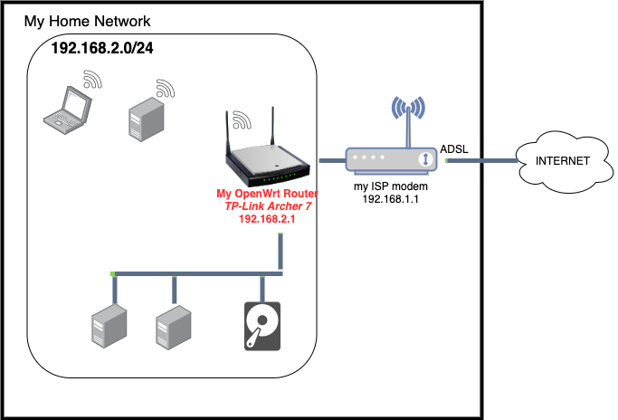

# My OpenWrt Router

## Router Model

**Model** : TP-Link Archer C7 Dual Band Gigabit WiFi-router (1300 Mbps (5 GHz) + 450 Mbps (2,4 GHz), 5 Gigabit LAN-port, 1 USB 2.0-port) Black

**Price**: 56 € (nov 2021)

**Memory**: 120 MB

**Architecture**: Qualcomm Atheros QCA956X ver 1 rev 0

## Flashed with OpenWrt

**Firmware version** : `OpenWrt 21.02.0 r16279-5cc0535800 / LuCI openwrt-21.02 branch git-21.231.26241-422c175`

The [OpenWrt Project](https://openwrt.org/) is a Linux operating system targeting embedded devices (typically wireless routers).

!!! tip "Tip: Assure you buy a router that is in the list of [OpenWrt supported devices](https://openwrt.org/supported_devices)."

## Location in my home network

## Why ?

1. Flashing a router with OpenWrt was on my nerd bucketlist
2. Learn about routers, networking and OpenWrt
3. Have full control to configure your home network
    * This is especially relevant if your ISP modem doesn't allow to configure all things
4. Maybe to get better WiFi  (as your are using the WiFi of the OpenWrt Router iso of the ISP modem)

## Configuration

I don't remember everything I did 2 years ago, but a lot of information can be found at:
* https://openwrt.org/
* https://forum.openwrt.org/

!!! example "[DEMO OpenWrt router administrator site](http://archer7.lan)"

### IPv6 - out of scope

I ignored IPv6 configuration.
IPv4 is sufficient for me.

### Configure routing / network

The main configuration steps (as I remember it) to setup my `192.168.2.0/24` network

1. Configure Network>Interfaces

2. *Firewall configuration*

Below settings opens firewall in both directions + enables masquerading in both directions.

* allows to ping from OpenWrt Router LAN to ISP modem LAN
* allows to access the internet from OpenWrt Router LAN
* doesn't allow to ping Archer LAN from ISP modem LAN
* allows to access OpenWrt Router via its ISP modem LAN IP address (http://192.168.1.56)

