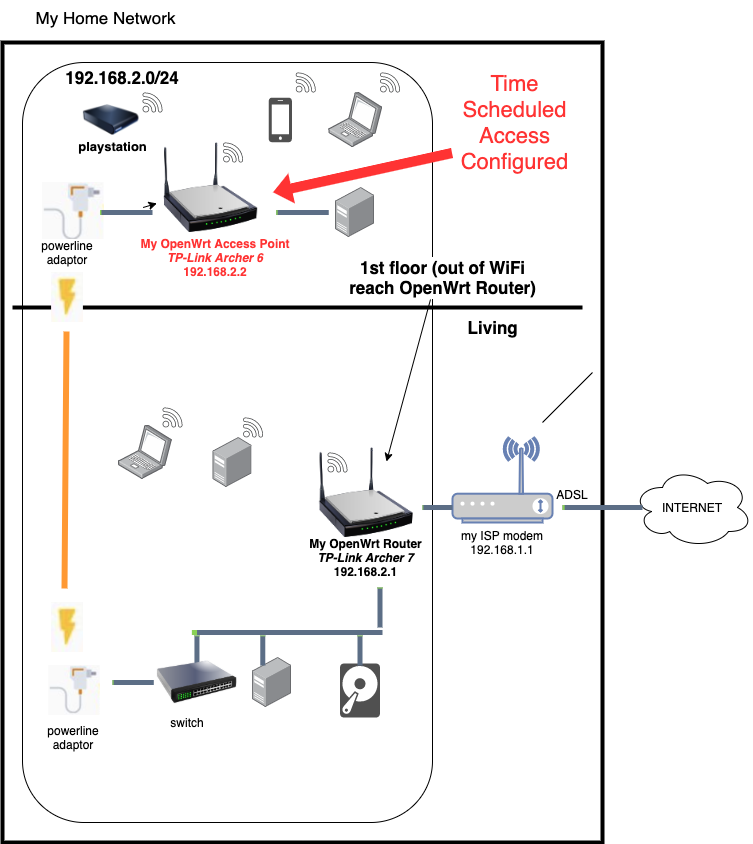
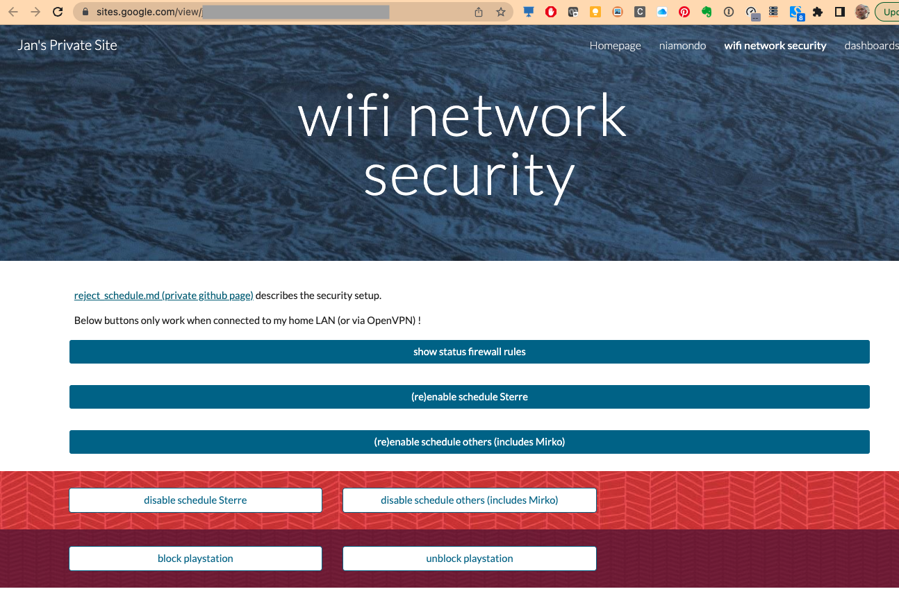

# OpenWrt Time Scheduled Access Control

Before reading this topic, first read topic: [My OpenWRT Access Point](./../openwrt_access_point/README.md)

## What ?

1. Define a time schedule for each of my kids during which they can access the WiFi of [My OpenWRT Access Point](./../openwrt_access_point/README.md) with their devices (labtop, phone, ...).
    * This schedule can also be disabled so that they can access WiFi outside the time schedule when really needed.
2. Enable/disable access for a specific device (e.g. a playstation)

## Where ?



## How ?

### Define 3 IP ranges

I have defined following 3 IP ranges

| name | ip/mask | ip range | description |
|--:|---|:---:|--|
| `privileged` | not in below groups | `192.168.2.1-192.168.2.111` | privileged devices |
| `my_daughter` | `192.168.2.112/28`  | `192.168.2.113-192.168.2.126` | devices of my daughter |
| `my_son_and_co` | `192.168.2.128/25` | `192.168.2.129-192.168.2.254` | all other devices (includes ps4 (playstation) = `192.168.2.131`) |

### Assure all connected devices receive an IP address in the proper IP range

This is configured in [my openWrt Router](./../openwrt_router/README.md):

* for the `privileged` and `my_daughter` devices: I achieved this through the configuration of *Static Leases*
* for the `my_son_and_co` devices I achieved this through *Static Leases* and configuring my DHCP server so that it gives IP addresses for devices without a static lease defined in that range.

??? example "[Show OpenWrt setup of DHCP server](http://archer7.lan)"

    FYI the DHCP server of my OpenWrt router is setup to allocate IP addresses in the range `my_son_and_co` as follows:

    1. For this goto Network > Interfaces > Lan > Edit
    2. Select DHCP Server
    3. Specify `Start = 129` and `Limit = 125`
    4. Save the changes.

### Create firewall rules on [my OpenWrt Acces Point](./../openwrt_access_point/README.md)

#### Install additional packages

I have installed following packages on [my OpenWrt Acces Point](./../openwrt_access_point/README.md)

* `ipset` : is needed to use masks in the firewall rules ( `/28`)
* `luci-app-commands`: is needed for shell commands through URL (custom commands)
* `kmod-br-netfilter`: is needed to assure that the bridge firewall rules work  (see following section)

#### Enable bridge firewall

Note that my [my OpenWrt Acces Point Router](./../openwrt_access_point/README.md) is used as bridge (the WAN port is not used).  
By default the firewall rules are not applied for LAN - LAN traffic.
To assure that firewall rules are also applied for LAN to LAN traffic we must enable bridge firewall as outlined in this section.

Follow instructions outlined at to enable firewall rules for LAN - LAN traffic accross the bridge:

* https://openwrt.org/docs/guide-user/firewall/fw3_configurations/bridge

In other words perform following instructions:

```sh
# Install packages
opkg update
opkg install kmod-br-netfilter
 
# Configure kernel parameters
cat << EOF >> /etc/sysctl.conf
net.bridge.bridge-nf-call-arptables=1
net.bridge.bridge-nf-call-iptables=1
net.bridge.bridge-nf-call-ip6tables=1
EOF
/etc/init.d/sysctl restart

# Log and status
/etc/init.d/firewall restart
```

#### Create firewall reject traffic rules with appropriate schedule

From web interface goto Network > Firewall > Traffic Rules and add rules that "reject" access for the IP groups `my_daughter` and `my_son_and_co` during the workdays and during the weekend.

FYI the following rules are created:

* `iprange_sterre_reject_during_workdays`
* `iprange_sterre_reject_during_weekend`
* `iprange_mirko_and_co_reject_during_workdays`
* `iprange_mirko_and_co_reject_during_weekend`
* `playstation_reject`

??? example "[Show my firewall rules](http://archer6.lan)"

    goto Network > Firewall > Traffic Rules

#### Create custom command to disable/enable the schedule firewall rules

Steps:

1. I have created following script that enables/disables a specific firewall rule or lists the status (`enabled`/`disabled`) of all firewall rules.

    ??? abstract "[fw_reject_schedule.sh (click me to download script)](./fw_reject_schedule.sh)"

        ``` sh
        --8<-- "docs/topics/openwrt_time_scheduled_access/fw_reject_schedule.sh"
        ```

2. Copy [fw_reject_schedule.sh](./fw_reject_schedule.sh) to my router (folder = `/root`)
     * Assure this script is executable (`chmod a+x fw_reject...`)
2. Create a custom command with name `reject schedule` via menu `System` > `Custom Commands` > tab `configure` that is calling `/root/fw_reject_schedule.sh` and allows Customs argument and Public access.
3. You can now trigger the command via menu `System` > `Custom Commands` > tab `Dashboard`.
   * On this tab you can also get the URL (click on `link` and take the url next to `display result`) to launch the script from the browser
      * the script parameters can be passed as specified in forum topic [How to pass arguments in custom command link url?](https://forum.openwrt.org/t/how-to-pass-arguments-in-custom-command-link-url/108804)

??? example "[Show my custom command](http://archer6.lan)"

    goto `System` > `Custom Commands` > tab `Dashboard`

### Create google site page to trigger custom command

Create a personal google site that you alone can access

* For more information about google sites see topic [Google Site](../google_sites/README.md)

Create a new page on this google site with 7 buttons:

* `show status (enable/disable) of all firewall rules`
* `(re)enable schedule Sterre`
* `(re)enable schedule others (includes Mirko)`
* `disable schedule Sterre`
* `disable schedule others (includes Mirko)`
* `block playstation`
* `unblock playstation`

These buttons open a custom command URL (see previous section) with appropriate 2 parameters to enable/disable the schedule for sterre or mirko or to block/unblock internet access for playstation.



!!! example "Show my google site with custom commands"

## Conclusion

⨁ It has worked very reliably

⊖ No longer used as kids are too old and are not playing that much on playstation

⊖ blocked internet access can be circumvented using mobile data
