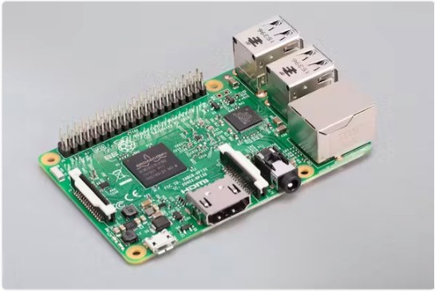

# Raspberry Pi

I have 3 Raspberry Pi 3 Model B with hostnames:

* `pi3one`
* `pi3two`
* `pi3three`


## Hardware specifications

Raspberry Pi 3 Model B specifications

| what | type / specifications |
| -- | -- |
|  model |  [Raspberry Pi 3 Model B](https://www.raspberrypi.com/products/raspberry-pi-3-model-b/) |
| RAM | 1 GB |
| SD card | 32 - 64 GB | 
| CPU | Quad Core 1.2GHz Broadcom BCM2837 64bit CPU |
| WiFi & bluetooth | BCM43438 wireless LAN and Bluetooth Low Energy (BLE) on board. |
| ethernet | 100 Base Ethernet (100Mbit) | 

## OS (Operating System)

I have installed (or upgraded to) *32 bit raspbian Buster (Debian Linux)*

FYI installing an OS on SD card is very simple:

1. downloaded `2021-05-07-raspios-buster-armhf-full.img`
2. with balenaEtcher wrote it to 64GB SD card
3. booted raspberry pi wth 64GB SD card

Note that *Raspbian* has been renamed to *Raspberry Pi OS*.  The latest OS versions (including 64 bit) can be found [here](https://www.raspberrypi.com/software/operating-systems/).

## CPU INFO

```
pi@pi3one:~ $ cat /proc/cpuinfo
processor       : 0
model name      : ARMv7 Processor rev 4 (v7l)
BogoMIPS        : 51.20
Features        : half thumb fastmult vfp edsp neon vfpv3 tls vfpv4 idiva idivt vfpd32 lpae evtstrm crc32 
CPU implementer : 0x41
CPU architecture: 7
CPU variant     : 0x0
CPU part        : 0xd03
CPU revision    : 4

processor       : 1
...<same output as processor 0>

processor       : 2
...<same output as processor 0>

processor       : 3
...<same output as processor 0>

Hardware        : BCM2835
Revision        : a02082
Serial          : 00000000f....b
Model           : Raspberry Pi 3 Model B Rev 1.2
pi@pi3one:~ $ 
```

## Initial Setup as headless device (enable ssh)

After installing the OS you need to setup ssh, WiFi so you can remotely access it in your network as a headless device.
To do so you must (only once) connect a keyboard, mouse and monitor to your raspberry pi.
I think the first time you power on, it will ask you to configure all these things if not you
 can run  raspi-config by entering following command in a terminal window: `sudo raspi-config`.

Using raspi-config you can make following changes:

1. in `1 System Options > S1 Wireless LAN` : this must be configured if your device is not connecting to your network via its ethernet port but through WiFi.
1. in `3 Interface Options > P2 SSH` : enable SSH interface !
2. in `5 Localisation Options` you can specify your keyboard layout if you are not using a standard keyboard


!!! tip "passwordless ssh logon from macbook"

    Just enter below command in terminal window on your macbook to allow passwordless ssh access to `pi3one`

    ```sh
    ssh-copy-id pi@pi3one
    ```

## Main Pros and Cons

### Pros

1. low energy consumption
2. cheap
3. many ways to extend via the 40 GPIO (General-Purpose Input/Output) pins
4. replace OS by swapping SD cards with new OS

### Cons

1. limited memory (max 1 GB)
    - this becomes an issue if you want to run (several) memory intensive docker containers.
2. Outdated - you get more value for money if you go for Raspberry Pi 4.
3. [SD card corruption](https://hackaday.com/2022/03/09/raspberry-pi-and-the-story-of-sd-card-corruption/) (Note that I  can't remember having those)

